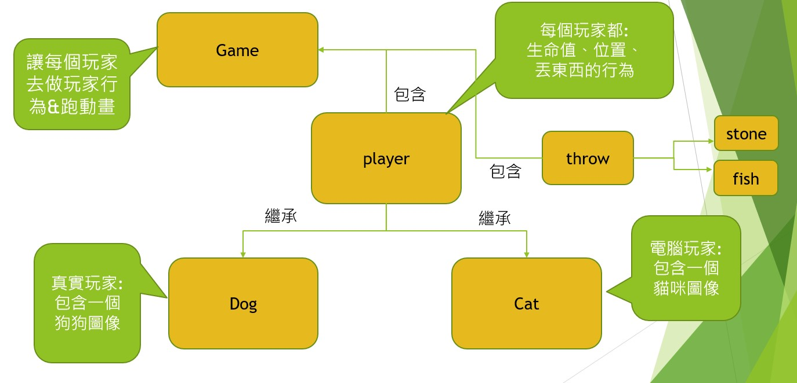
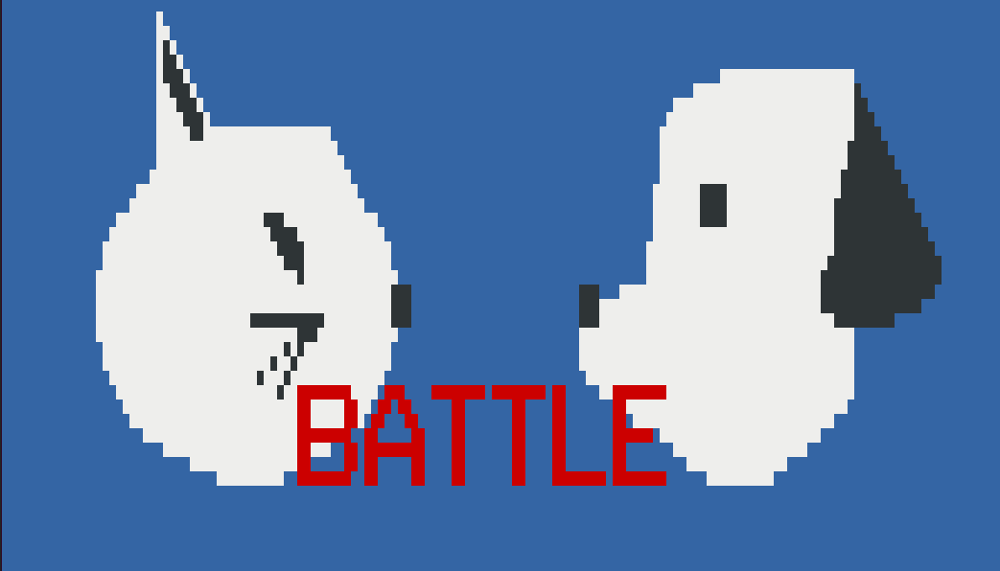
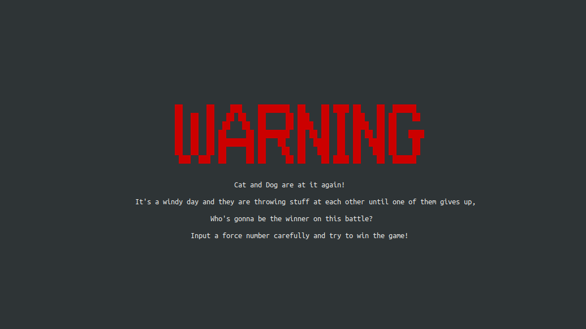
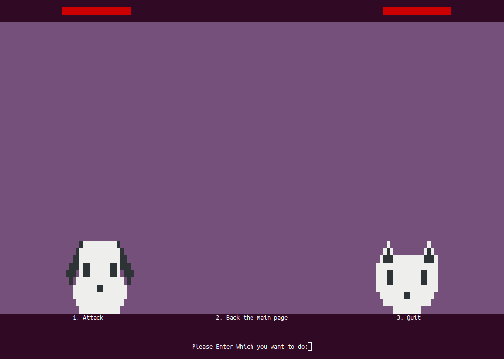

# Cat Dog Battle  
  
  

## Introduction of this Game  
  
  
  
## How to Play this Game  
  
每一回合，貓跟狗可以互相朝對方丟躑物品，  
玩家可以選擇每次攻擊的力道，若攻擊力道符合當時距離，  
則會擊中對方並使對方血量降低5點，若對方生命值（初始20點）歸零，  
即取得勝利。  
每回合開始及每次任一玩家擊中後，貓與狗間的距離會重新隨機產生。  
  
## All Class We use
  

  
## All interfaces in this Game  
  
 
The interface which go into to this game  
  
  
  
The interface which give gamers instructions  

  
The interface which gamers play this game  
  
  
  
The interface which we win this game  

  
  
The interface which we lose this game  
  
  
## Authors who make this game  
 
吳昀倫(Code Editor)

呂宜學(BackGround Maker && G-Funtion Maker)  

吳祐瑋(Topic Maker)  
  
陶亮清(Topic Maker)

陳冠全(PPT Maker) 
  
  
  

