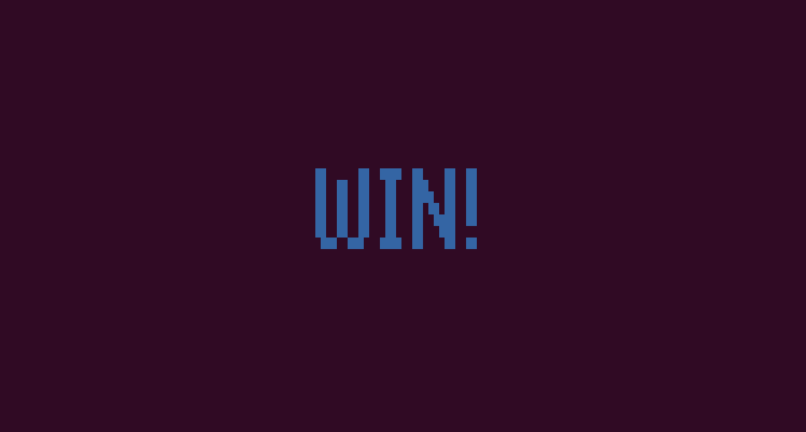

# Cat Dog Battle  
  
  

## Introduction of this Game  
  
Cat and Dog are at it again!  
It's a windy day and they are throwing stuff at each other until one of them gives up.  
Who's gonna be the winner on this battle.  
Input a force number carefully and try to win the game!  

## How to Play this Game  
  
Every Run, Cat Player and Dog Player can throw something at each other.   
Player can decise the power of any run,  
if power is equal to the result of G-Funtion,
another Player will change Picture and reduce its life.  
If the life of anyone is less than zero or equal to zero,  
This Game is over and show the result.  
If any run begin or anyone is hitted, the distance between dog and cat will generate randomly.  
  
## All Class We use
  

  
## All interfaces in this Game  
  
 
The interface which go into to this game  
  
  
  
The interface which give gamers instructions  

  
The interface which gamers play this game  
  
  
  
The interface which we win this game  

  
  
The interface which we lose this game  
  
  
## Authors who make this game  
 
吳昀倫(Code Editor)

呂宜學(BackGround Maker && G-Funtion Maker)  

吳祐瑋(Topic Maker)  
  
陶亮清(Topic Maker)

陳冠全(PPT Maker) 
  
  
  

